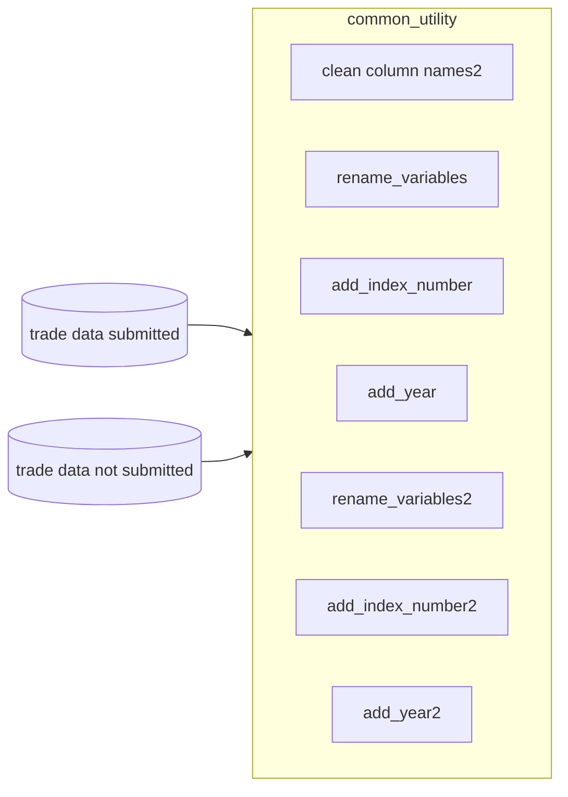
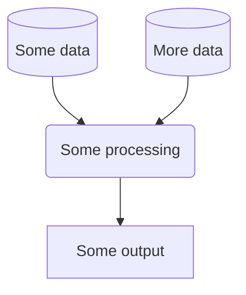

# Repository name
Palestine Central Bureau of Statistics Mentoring for trade statistics automation 
# Introduction


## About
A mentoring agreement between Palestinian Central Bureau of Statistics (PCBS) and the Data Science Campus (DSC) has been formalised. This offers assistance and guidance by DSC personnel to key staff at Palestinian Central Bureau of Statistics (PCBS) to assist in enabling automation of a current, manual pipeline to manipulate and analyse trade data. The new pipeline will follow best practices as propounded in the Reproducible Analytical Pipeline (RAP) framework. Regular weekly sessions are scheduled where the tasks in the pipeline are incrementally moved to the R programming language. PCBS staff are instructed on how to translate their current manual tasks to code in R. They are introduced to best practices in coding and collaborative working. In the latter case, the advantages of using Git/Github are shown through live demonstration of commands such as commit, push and pull. In the former case the emphasis is on writing modular, reusable code using functions in R.   
The repository contains R scripts produced jointly through the weekly online sessions. It also contains code produced by the mentees as they progress through their learning journey.


## Installation

<ul>
  <li>A GitHub account to enable the collaborative working according to RAP principles </li>
  <li>Set-up of a token to execute Github commands</li>
  <li>Clone the repository to local device</li>
  <li>Install R-Studio</li>
  <li>Setup of an R project linking to remote Github repository</li>
  <li>Installation of key data manipulation libraries in R</li>
</ul>

#### Clone the Github Repository

Clone the github repository to your local device.  
A general guide on cloning repositories is given [here](https://docs.github.com/en/repositories/creating-and-managing-repositories/cloning-a-repository). Cloning a private repository will require authentication; we suggest using a PAT token to do this. [This guide](https://docs.github.com/en/authentication/keeping-your-account-and-data-secure/creating-a-personal-access-token#creating-a-personal-access-token-classic) details how to set one up in your Github account. 

Once you have set up a PAT token, you can use the following CLI command (see below) to clone a the repository (replace `<USERNAME>` and `<PATTOKEN>` with your Github username and PAT token, respectively): 

`git clone https://<USERNAME>:<PATTOKEN>@github.com/datasciencecampus/nsa_industry_occupation_classification.git`

Alternatively, you do the same through Git GUI by clicking "Clone Existing Repository" and using `https://<USERNAME>:<PATTOKEN>@github.com/datasciencecampus/nsa_industry_occupation_classification.git` as the source location.


# File and folder description

```

📦PCBS Mentoring for trade statistics automation 
 ┣ 📂 data (hidden)
 ┃ ┣ 📜   submitted declaration excel file
 ┃ ┣ 📜   not submitted declaration excel file
 ┣ 📂 outputs
 ┃ ┣ 📜   Any outputs from running src files
 ┣ 📂src
 ┃ ┣ 📂 common_utils
 ┃ ┃ ┣ 📜 data_processing_and_cleaning.R
 ┃ ┃ ┗ 📜 importing_data.R
 ┃ ┃ ┣ 📜 load_required_packages.R
 ┃ ┣ 📂 functions_utils
 ┃ ┃ ┣ 📜 functions_utils.R
 ┣ 📜.gitignore
 ┣ 📜.pre-commit-config.yaml
 ┣ 📜LICENSE
 ┗ 📜README.md
 ```


### Pre-commit actions
This repository contains a configuration of pre-commit hooks. These are language agnostic and focussed on repository security (such as detection of passwords and API keys). If approaching this project as a developer, you are encouraged to install and enable `pre-commits` by running the following in your shell:
   1. Install `pre-commit`:

      ```
      pip install pre-commit
      ```
   2. Enable `pre-commit`:

      ```
      pre-commit install
      ```
Once pre-commits are activated, whenever you commit to this repository a series of checks will be executed. The pre-commits include checking for security keys, large files and unresolved merge conflict headers. The use of active pre-commits are highly encouraged and the given hooks can be expanded with Python or R specific hooks that can automate the code style and linting. For example, the `flake8` and `black` hooks are useful for maintaining consistent Python code formatting.

**NOTE:** Pre-commit hooks execute Python, so it expects a working Python build.

## Usage

All packages that are required to automate tasks can be found in the `load_required_packages.R` script. Any additional packages required should be added here. After any modification the script should be executed so that the alteration is registered by the R interpreter.
All user defined functions developed are added to the `functions_utils.R` script. These functions can then be used in scripts as required.
For each task in the PCBS trade statistics compilation, functionality is developed in R to do the manual task. This functionality is bundled together in scripts dependent on similarity of operations eg all cleaning tasks are in one script data_processing_and_cleaning.R in the `src` library. Functionality developed by mentees will also be found here.
The `data` folder contains the 2 main data files on trade activity and are not available for general viewing. All outputs from the scripts should be sent to the outputs folder.


### Workflow
*You may wish to consider generating a graph to show your project workflow. GitHub markdown provides native support for [mermaid](https://mermaid.js.org/syntax/flowchart.html), an example of which is provided below:*




# Data Science Campus
At the [Data Science Campus](https://datasciencecampus.ons.gov.uk/about-us/) we apply data science, and build skills, for public good across the UK and internationally. Get in touch with the Campus at [datasciencecampus@ons.gov.uk](datasciencecampus@ons.gov.uk).

# License

<!-- Unless stated otherwise, the codebase is released under [the MIT Licence][mit]. -->

The code, unless otherwise stated, is released under [the MIT Licence][mit].

The documentation for this work is subject to [© Crown copyright][copyright] and is available under the terms of the [Open Government 3.0][ogl] licence.

[mit]: LICENCE
[copyright]: http://www.nationalarchives.gov.uk/information-management/re-using-public-sector-information/uk-government-licensing-framework/crown-copyright/
[ogl]: http://www.nationalarchives.gov.uk/doc/open-government-licence/version/3/


# Repository name

# Introduction
## About
*Describe what this repo contains and what the project is.*

## Installation
*Describe technical set-up. Such as the required dependencies.*

### Pre-commit actions
This repository contains a configuration of pre-commit hooks. These are language agnostic and focussed on repository security (such as detection of passwords and API keys). If approaching this project as a developer, you are encouraged to install and enable `pre-commits` by running the following in your shell:
   1. Install `pre-commit`:

      ```
      pip install pre-commit
      ```
   2. Enable `pre-commit`:

      ```
      pre-commit install
      ```
Once pre-commits are activated, whenever you commit to this repository a series of checks will be executed. The pre-commits include checking for security keys, large files and unresolved merge conflict headers. The use of active pre-commits are highly encouraged and the given hooks can be expanded with Python or R specific hooks that can automate the code style and linting. For example, the `flake8` and `black` hooks are useful for maintaining consistent Python code formatting.

**NOTE:** Pre-commit hooks execute Python, so it expects a working Python build.

## Usage
*Explain how to use the things in the repo.*

### Workflow
*You may wish to consider generating a graph to show your project workflow. GitHub markdown provides native support for [mermaid](https://mermaid.js.org/syntax/flowchart.html), an example of which is provided below:*




# Data Science Campus
At the [Data Science Campus](https://datasciencecampus.ons.gov.uk/about-us/) we apply data science, and build skills, for public good across the UK and internationally. Get in touch with the Campus at [datasciencecampus@ons.gov.uk](datasciencecampus@ons.gov.uk).

# License

<!-- Unless stated otherwise, the codebase is released under [the MIT Licence][mit]. -->

The code, unless otherwise stated, is released under [the MIT Licence][mit].

The documentation for this work is subject to [© Crown copyright][copyright] and is available under the terms of the [Open Government 3.0][ogl] licence.

[mit]: LICENCE
[copyright]: http://www.nationalarchives.gov.uk/information-management/re-using-public-sector-information/uk-government-licensing-framework/crown-copyright/
[ogl]: http://www.nationalarchives.gov.uk/doc/open-government-licence/version/3/
